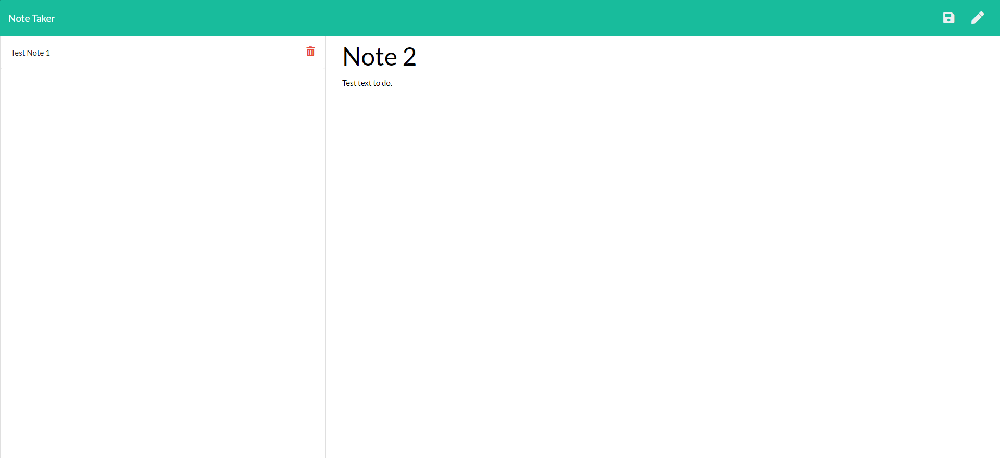

# Note Taker

[](https://opensource.org/licenses/MIT)

## Description

An application that allows the user to record notes and to delete the notes they create.

The application uses the express and uniqid package modules.

## 📖Table of Contents
1. [Installation](#installation)
2. [Usage](#usage)
3. [Assets](#assets)
4. [Technologies](#Technologies)
5. [License](#license)
6. [Contributing](#contributing)
7. [Tests](#tests)
8. [Questions](#questions)

## Installation
1. To install this project clone it through GitHub using the following code in the terminal: 
    ``` 
    git clone https://github.com/TrushilBudhia/Note-Taker.git
    ```
2. To add the dependencies to the project, navigate to the root directory for the project and run:
    ```js
    npm install
    ```
    
## Usage
To begin the application, navigate to the root directory for the project in your preferred terminal and run the following code:
```js
node run watch
```

## Assets
The following images shows the functionality of the Note Taker application:




## Technologies
- [Node.js](https://nodejs.org/en/docs/)
- [Express](http://expressjs.com/)
- [uniqid](https://www.npmjs.com/package/uniqid)
- JavaScript

## License
Copyright © 2021 [Trushil](https://github.com/TrushilBudhia)

This project is [MIT](./LICENSE) licensed

## Contributing
Contributions, issues and feature requests are welcome.

Feel free to check the [issues page](https://github.com/TrushilBudhia/Note-Taker/issues) if you want to contribute.

## Tests
There are no tests currently for this application.

## Questions
For any questions, please contact the author:

- Github: [@Trushil](https://github.com/TrushilBudhia)
- Email: trushil.budhia@gmail.com
